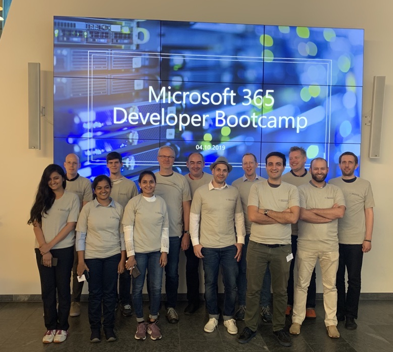

# Microsoft Global AI Bootcamp - Bot Lab

I wrote this lab initially for the Microsoft 365 Developer Bootcamp and enhanced it for Global AI Bootcamp. Hope you'll find it useful :-)

The Bot Lab is build with Dotnet Bot Builder SDK 4. 
## Labs
### [Lab 1 - Getting Started](./docs/bot-lab-1.md)
### [Lab 2 - Teams Bot](./docs/bot-lab-2.md)
### [Lab 3 - Adaptive Cards](./docs/bot-lab-3.md)
### [Lab 4 - Authentication](./docs/bot-lab-4.md)
### [Lab 5 - QnA Maker](./docs/bot-lab-5.md)
### [Lab 6 - Composer (Preview)](./docs/bot-lab-6.md)

 

### Thanks to the attendees of the Global Microsoft 365 Developer Bootcamp Zürich 10/04/2019 for their contributions

 

## Credits
Thanks for your contribution!
- [David Schneider](https://github.com/fiddi)
- Manuel Sidler
- [Peter Wiens](https://github.com/peterwiens)
- [Sven Saatkamp](https://github.com/svaenn)
