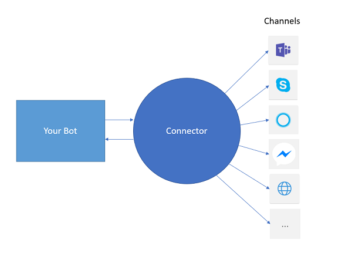
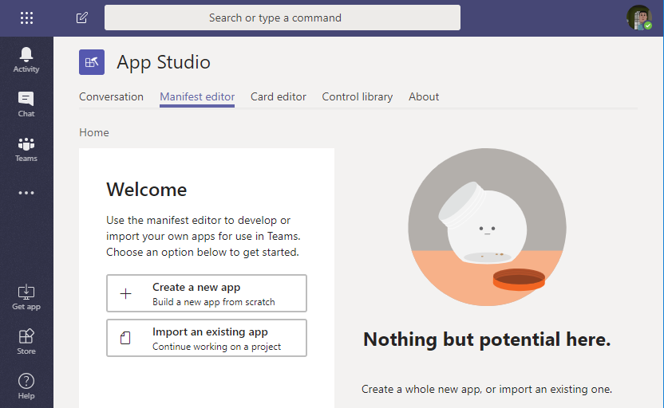

# Global AI Bootcamp
## Lab 2 - Teams Bot

## Prerequisites 
- Lab 1


## Connect the Bot with Teams
To connect our bot to Teams with we need a middleware in Azure, the such called Bot Connector. The bot connector provides an abstraction between our Bot and the various channels the Bot Framework can communicate with. 
You can host your Bot wherever you want, but the Bot Connector must be hosted on Azure. 



In this Lab we are going to host the bot on our dev box so that we can easily debug the bot. To test the Bot Connector with Teams we need a public endpoint for our Bot. To provide a public endpoint for our local Bot we use a tool called **ngrok**.
[**Ngrok**](https://ngrok.com/) is a multiplatform tunnelling, reverse proxy software that establishes secure tunnels from a public endpoint such as internet to a locally running network service like our bot.

### Local Debugging
- Download [Ngrok](https://ngrok.com/) and extract the zip to a local folder.
- Navigate with Bash or PowerShell to the previous created folder.
- Execute the following command:
```bash
.\ngrok http localhost:3978
```
The result should look like this:


The yellow marked address is our public endpoint that we need later. You test the tunnel, verify that the bot is started and than browse to the endpoint, for example https://5c0c876a.ngrok.io/. You should see the bot welcome screen.
The the shell with ngrok have to keep open and running.

### Create the Bot Connector in Azure
The next step is to create the Bot Connector in Azure
-   Login to https://portal.azure.com
-   Click on "Create Resource"
-   Search for, choose and create a **Bot Channels Registration**
-   Enter the following data:
    -   Bot name: this is the bot handle and name. This will be the chat handle you use in Teams and other channels to communcatie with the bot. The need a global unique name. In this demo the bot name is "TeamsBot101".
    -   Subscription: subscription where you want to host the connector
    -   Resource group: choose an existing one or create a new one, for example "TeamsBot"
    -   Location: the location where you want to host the connector. 
    -   Pricing tier: choose F0
    -   Message endpoint: enter the ngrok endpoint from above and append /api/messages, for example https://5c0c876a.ngrok.io/api/messages  
    -  Application Insights: On
    -  Application Insights Location: choose the same location as above
    -  Microsoft App ID and password: "Auto Create App ID and password"
    -  Create
    -  ...
-  When the connector is created, browse to its details blade in the Azure Portal
-  Choose Settings
    -  Optional: Upload a bot icon, for example [this](/docs/images/bot-icon.png).
    -  Look for the subheadline "Microsoft App ID" and click on "Manage".
    -  Copy and save the "Application Id" (we need this later)
    -  Click on "Generate New Password", copy and save the password (we need this later). 
-  Navigate to "Channels"
    -  Click on the Teams Channel
    -  Save
  
The connector is ready now!

> The App registration that we just generated uses Client Credentials flow to secure the server to server connection between your Bot and the Microsoft Bot Connector. The App doesn't need any permission, but must have muti-tenant scope in case you want to create the app registraction manually.
  
### Configure the Bot
- Back in VS Code open the appsettings.json file  
- Replace "MicrosoftAppId" and "MicrosoftAppPassword" with the values from above
- Restart the Bot
- Test the configuration ine the Bot Emulator. File -> open -> enter your ngrok url e.g. https://5c0c876a.ngrok.io/api/messages ans the App Id and Password like in the settings file.
- Connect


### Add the Bot to Teams (via Deep Link)
Without any further configuration you can now start chating with the Bot via a deep link. To get the deep link just go back to the "Channel Settings" in Bot Connector's details blade on Azure and click on the "Microsoft Teams Channel" link. The link will start a direct chat with your Bot. Let's say hi!


You can distribute your Bot to everybody with sharing the deep link. With the deep link you can only start direct chats. You can't add the Bot to a Teams Channel.

To leverage the full potential of Bots in Teams you have to create a Teams App.

## 3. Create a Teams App
Teams App are only registrations, the services are hosted wherever you want. The easiest and recommend way to create a Teams App is the "App Studio", which is a Teams App itself. 

- Install "App Studio" App via the Teams Store

- Within the App Studio switch to the "Manifest Editor"
- "Create a new app"

- "App Details" (fill out the required fields):
    - Short name: "My Teams App"
    - App ID: click generate
    - Package Name: for example com.contoso.teams.app101
    - Version: 0.0.1
    - Short description: First Test App
    - Long description: First Test App
    - Name: your name/company
    - Website: your website
    - Privacy Statemets: for the demo you can just take any URL
    - Terms of use: for the demo you can just take any URL
- Switch to "Capabilities"
    - Bots -> Set up
    - Existing bot
        - Name: use the same name for the bot as in the connector above
        - Connect to a different bot id: copy & paste the "appId" from above 
        - Scope:
            - (x) Personal 
            - (x) Team
        - Save
    - Optional: Commands - with commands you can give the users hint about the bot's capabilities 
        - Command Text: "Say hello"
        - Help Test: Replies "Just returns the echo"
        - Scope: 
            - (x) Personal 
            - (x) Team
        - Save
- Finish
    - Click "Test and distribute"
    - Click "Install"
        - "Add for you" -> Yes
        - "Add to team" -> select the team where you want to install the bot
        - Install
        - Pick the channel where you want to add the bot
        - Set up
- Now you can chat with your bot either via direct messages or in a Teams channel


You can download the App Package or publish it to the store.


