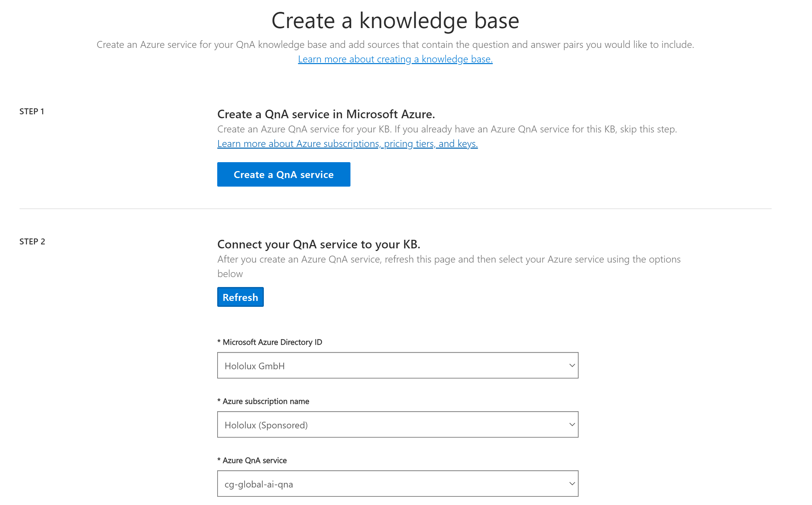
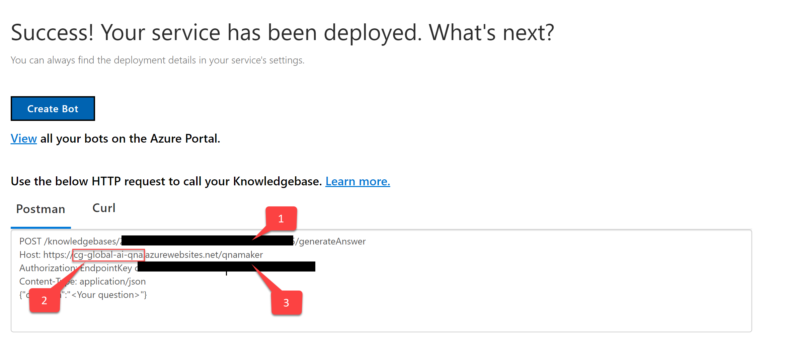
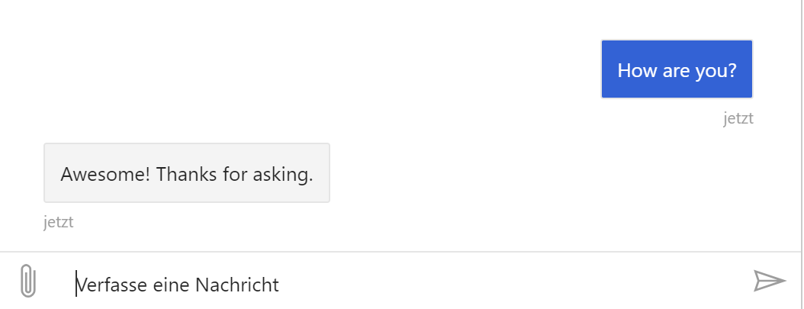

# Global AI Bootcamp
## Lab 4 - QnA Maker 

## Create a new QnA Maker service

This procedure creates the Azure resources needed to manage the knowledge base content. After you complete these steps, you'll find the _subscription_ keys on the **Keys** page for the resource in the Azure portal.

1. Sign in to the Azure portal and [create a QnA Maker](https://ms.portal.azure.com/#create/Microsoft.CognitiveServicesQnAMaker) resource.

1. Select **Create** after you read the terms and conditions:

    

1. In **QnA Maker**, select the appropriate tiers and regions:

    

    * In the **Name** field, enter a unique name to identify this QnA Maker service. This name also identifies the QnA Maker endpoint that your knowledge bases will be associated with.
    * Choose the **Subscription** under which the QnA Maker resource will be deployed.
    * Select the **Pricing tier** for the QnA Maker management services (portal and management APIs). See [more details about SKU pricing](https://aka.ms/qnamaker-pricing).
    * Create a new **Resource group** (recommended) or use an existing one in which to deploy this QnA Maker resource. QnA Maker creates several Azure resources. When you create a resource group to hold these resources, you can easily find, manage, and delete these resources by the resource group name.
    * Select a **Resource group location**.
    * Choose the **Search pricing tier** of the Azure Cognitive Search service. If the Free tier option is unavailable (appears dimmed), it means you already have a free service deployed through your subscription. In that case, you'll need to start with the Basic tier. See [Azure Cognitive Search pricing details](https://azure.microsoft.com/pricing/details/search/).
    * Choose the **Search location** where you want Azure Cognitive Search indexes to be deployed. Restrictions on where customer data must be stored will help determine the location you choose for Azure Cognitive Search.
    * In the **App name** field, enter a name for your Azure App Service instance.
    * By default, App Service defaults to the standard (S1) tier. You can change the plan after creation. Learn more about [App Service pricing](https://azure.microsoft.com/pricing/details/app-service/).
    * Choose the **Website location** where App Service will be deployed.

        > [!NOTE]
	    > The **Search Location** can differ from the **Website Location**.

    * Choose whether or not you want to enable **Application Insights**. If **Application Insights** is enabled, QnA Maker collects telemetry on traffic, chat logs, and errors.
    * Choose the **App insights location** where the Application Insights resource will be deployed.
    * For cost savings measures, you can [share](#share-existing-services-with-qna-maker) some but not all Azure resources created for QnA Maker. 

1. After all the fields are validated, select **Create**. The process can take a few minutes to complete.

1. After deployment is completed, you'll see the following resources created in your subscription:

   

    The resource with the _Cognitive Services_ type has your _subscription_ keys.

## Find subscription keys in the Azure portal

You can view and reset your subscription keys from the Azure portal, where you created the QnA Maker resource.

1. Go to the QnA Maker resource in the Azure portal and select the resource that has the _Cognitive Services_ type:

    

2. Go to **Keys**:

    

## Find endpoint keys in the QnA Maker portal

The endpoint is in the same region as the resource because the endpoint keys are used to make a call to the knowledge base.

Endpoint keys can be managed from the [QnA Maker portal](https://qnamaker.ai).

1. Sign in to the [QnA Maker portal](https://qnamaker.ai), go to your profile, and then select **Service settings**:

    

2. View or reset your keys:

    


## Create a new QnA Maker Knowledge Base
Create an account at https://www.qnamaker.ai/ and [create a knowledge base](https://www.qnamaker.ai/create)

 

Choose one of the predefined chit chat knowledges to have some test data. And feel free to add some custom questions answer pairs of your own to play with.

**Don't forget to save, train and publish the model!**

After you have published the model you will find the following information:
 
1) QnAKnowledgeBase
2) QnAEndpointHost
3) QnAEndpointKey

You will need this information in the next chapter.


## Create a project with dotnet new (or try to integrate the QnA Maker into the bot of the previous lab)

Create a folder for your poject and execute the following commands:
```bash
dotnet new -i Microsoft.Bot.Framework.CSharp.EchoBot
dotnet new echobot -n TeamsBot
```

## Install QnA Maker C# Library
```PowerShell
dotnet add package Microsoft.Azure.CognitiveServices.Knowledge.QnAMaker
```

Add the following setings to **appsettings.json** or *appsettings.Development.json*
```
{
...
"QnAEndpointHost":"...",
"QnAEndpointKey": "...",
"QnAKnowledgeBase": "..."
}
```

Replace the code in  **EchoBot.cs** with:
```csharp
using System.Threading;
using System.Threading.Tasks;
using Microsoft.Azure.CognitiveServices.Knowledge.QnAMaker;
using Microsoft.Azure.CognitiveServices.Knowledge.QnAMaker.Models;
using Microsoft.Bot.Builder;
using Microsoft.Bot.Schema;
using System.Linq;
using Microsoft.Extensions.Configuration;

namespace TeamsBot.Bots
{
    public class EchoBot : ActivityHandler
    {
        private readonly string kbId;
        private readonly QnAMakerRuntimeClient qnaClient;
        public EchoBot(IConfiguration config)
        {
            kbId = config["QnAKnowledgeBase"];
            qnaClient = new QnAMakerRuntimeClient(
                new EndpointKeyServiceClientCredentials(
                    config["QnAEndpointKey"]))
            {
                RuntimeEndpoint = $"https://{config["QnAEndpointHost"]}.azurewebsites.net"
            };
        }

        protected override async Task OnMessageActivityAsync(ITurnContext<IMessageActivity> turnContext, CancellationToken cancellationToken)
        {
            var response = await qnaClient.Runtime.GenerateAnswerAsync(
                kbId,
                new QueryDTO { Question = turnContext.Activity.Text }
            );

            foreach (var answer in response.Answers.Where(x => x.Score > 7.5))
            {
                await turnContext.SendActivityAsync(answer.Answer);
            }
        }
    }
}
```
Try out QnA bot in the emulator.


